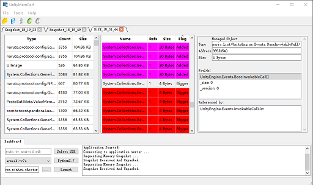

# Unity MemPerf

UnityMemperf是一款专为**Unity**引擎**安卓**平台**IL2CPP**运行时打造的高性能**内存分析、泄露检查、快照对比**工具

参考[PerfAssist](https://github.com/GameBuildingBlocks/PerfAssist/)进行功能开发，通过安卓注入技术，实现了连接USB即可实时抓取内存快照的功能

**目前支持Windows7/10与MacOSX（Mojave+），Windows需提供Python2.7**

**目前测试过的支持的安卓版本为：7，8，9**

**目前测试过支持的Unity为：5.6.6f2，2018.3.13f1，2019.2.9f1**

**注意：请关闭AndroidStudio、UE4等可能占用ADB的程序再使用本程序！**

> [程序下载](https://wetest.oa.com/store/unity-memperf)、[使用手册](https://git.code.oa.com/xinhou/unity_memperf/wikis/tutorial)

**注意：此程序仍处于初级研发阶段**

## 特性

- 可以Profile安卓平台Debuggable的Unity程序
  * 已验证版本：Unity5.6.6f2，Unity2018.3.13f1
- 操作简单：只需连接手机，选择并开启程序即可开始抓取内存快照
- 实现了大部分PerfAssist的交互功能
  * 记录选择操作历史，方便回看
  * 展示Managed对象字段数据，引用数据等底层信息
  * 可对不同内存快照进行Diff操作，方便检查Managed内存泄露
- 从手机端实时获取内存快照数据（仅含IL2CPP运行时，不包含UnityNative信息）
- 网络包使用LZ4压缩以加快收发速度
- 运行流畅（使用C++与QT开发）
- 同时支持Windows 10与Mac OSX（Mojave+）操作系统

## 计划

**短期计划**

* 验证并支持更多版本的Unity引擎
* 发现并优化用户体验相关问题
* 计划中 ... 

## 技术选择

我通过JDWP（ Java Debug Wire Protocol）技术进行对Unity安卓程序的动态库注入

在动态库的 JNI_OnLoad 中对 Profile 程序进行初始化（开启 TCP Server，开启检测线程等）

在JNI_OnLoad函数中，通过dlopen与dlsym可以获取到 il2cpp_capture_memory_snapshot 函数接口，通过此接口即可实现远程操控的内存快照截取操作

## 编译

**环境**

* QT 5 或更高
* QT Creater 4.8 或更高
* C++11 编译器
* Android NDK r16b 或更高（如需自行编译安卓插件）

## 链接

* JDWP库 https://koz.io/library-injection-for-debuggable-android-apps/
* 图标 https://www.flaticon.com/authors/smashicons
* 工具图标 https://www.flaticon.com/authors/freepik
* Wetest商店 https://wetest.oa.com/store/unity-memperf
